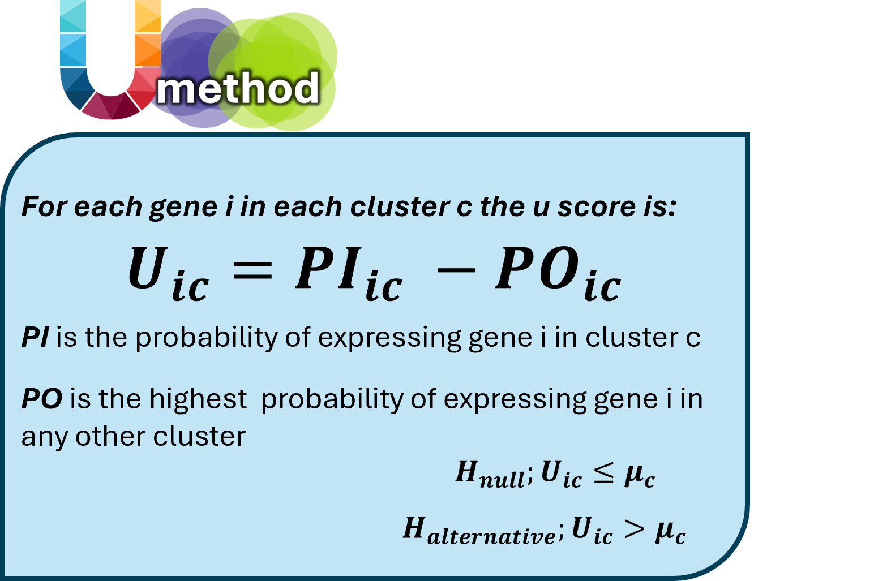

# U-method: Identify Unique Markers in Single-Cell and Spatial Data

**U-method** is an R package for identifying unique markers in single-cell datasets and visualizing them using high-resolution Visium HD spatial data. The method is designed for fast, interpretable marker detection and downstream spatial analysis.

## Example Usage

## Reference Dataset

This tutorial uses a reanalyzed dataset from:

- **Lee, Hae-Ock, et al. Nature Genetics (2020)**  
  *"Lineage-dependent gene expression programs influence the immune landscape of colorectal cancer."*  
  ArrayExpress: [E-MTAB-8410](https://www.ebi.ac.uk/arrayexpress/experiments/E-MTAB-8410/)

## Installation

To install **U-method** from GitHub:

```{r, eval=FALSE}
# Install devtools if you haven't already
install.packages("devtools")

# Install Umethod package from GitHub
devtools::install_github("YanuvS-Dev/Umethod")

# Load the package
library(Umethod)
```


## Timing the U-method

We include benchmark results to highlight the speed and efficiency of the U-method — 
from detecting robust markers to generating spatial and single-cell classifications. 

Thanks to its lightweight and scalable implementation, the U-method is ideally suited 
for integration into machine learning pipelines and large-scale data workflows.

```{r setup-timer, include=FALSE}
start_time <- Sys.time()
```

## FindUniqueMarkers Algorithm

The `FindUniqueMarkers` function identifies the most **unique markers** for each cluster in a Seurat object.

```{r, echo=FALSE}

```

## 1. Load Example Data

```{r, warning=FALSE, message=FALSE}
# Load the U-method package
library(Umethod)
library(Seurat)
library(reshape2)
library(scales)
library(Matrix)

# Optional - plotting results
library(cowplot)
library(ggplot2)
library(arrow)

# Load the published dataset
rds_url <- "https://github.com/YanuvS-Dev/Umethod/raw/master/inst/extdata/ColonSinglecellDataLeesUmethodSubsampled10.rds"
seurat_Full <- readRDS(url(rds_url, "rb"))
```

## 2. Identify Unique Markers

```{r, warning=FALSE, message=FALSE}
UmethodResults <- FindUniqueMarkers(
  obj = seurat_Full,
  group_by = "Celltype",
  method = "BH",
  omitCluster = c("CAFelse", "SmallElse")
)
```

## 3. Plot Top U-Markers (UMAP, DotPlot, FeaturePlot)

```{r, fig.width=27, fig.height=14, out.width='100%', dpi=300, warning=FALSE, message=FALSE}
plot_grid(
  plot_grid(
    DimPlot(object = seurat_Full, reduction = "UMAP_on_harmony", pt.size = 0.5, group.by = "Celltype"),
    DotPlot(seurat_Full, features = c(UmethodResults$gene_set), group.by = "Celltype", scale = FALSE) +
      theme(axis.text.x = element_text(angle = 90, vjust = -0.0001)),
    ncol = 1
  ),
  FeaturePlot(
    object = seurat_Full,
    features = UmethodResults$gene_set[1, ],
    cols = c("gray", "blue"),
    reduction = "UMAP_on_harmony",
    ncol = 3,
    order = TRUE
  ),
  ncol = 2
)
```

```{r, echo=TRUE}
cat("Time to load the data, apply the U-method, and generate UMAP plots: ", round(difftime(Sys.time(), start_time, units = "secs"), 2), "seconds
")
```


## Visualizing Markers on Visium HD

### Load Visium HD Data

To visualize marker expression spatially, the U-method integrates Seurat metadata with high-resolution Visium HD spatial transcriptomic data. In this tutorial, we use two real colorectal cancer samples:

- **NAT5 (normal adjacent tissue)** — a healthy reference region.
- **CRC5 (tumor tissue)** — a malignant region from the same patient.

We use 8µm-binned versions of the data here due to GitHub storage constraints. However, the U-method is designed to work directly on full-resolution (2µm) Visium HD data, achieving >95% unique spot assignment.

To run the spatial pipeline, two essential files are needed for each sample:

1. The filtered gene expression matrix (`filtered_feature_bc_matrix/`)
2. The spatial barcode metadata file (`tissue_positions.parquet`)

Example data used here was originally published by:

**Oliveira, Michelli F., et al. (2024)**  
*Characterization of immune cell populations in the tumor microenvironment of colorectal cancer using high-definition spatial profiling.*  
bioRxiv. DOI: 2024-06


## 4. Load Visium HD Data — Normal Sample (NAT5, 8µm)

```{r, warning=FALSE, message=FALSE}
counts_matrix <- Read10X("C:/myGithub/Uemethod_Bigfiles/VisiumHDcolon/NAT5/8um/filtered_feature_bc_matrix/")
poaraq <- read_parquet("C:/myGithub/Uemethod_Bigfiles/VisiumHDcolon/NAT5/8um/spatial/tissue_positions.parquet")

seurat_object <- CreateImageData(
  counts_matrix = counts_matrix,
  poaraq = poaraq,
  markers = c(UmethodResults$gene_set)
)
```

## 5. Compute Signature Scores for Normal Sample

```{r, warning=FALSE, message=FALSE}
datainput_control <- UmethodSignatureMap(
  seurat_object = seurat_object,
  gene_set = UmethodResults$gene_set
)
```

## 6. Plot Spatial Signatures — Normal Sample

```{r, warning=FALSE, message=FALSE, fig.width=27, fig.height=14, out.width='100%', dpi=300}
g <- list()
for (i in datainput_control$Classlist) {
  index <- which(datainput_control$Classlist == i)
  g[[index]] <- ggplot(
    datainput_control$signatureLong[
      datainput_control$signatureLong$Class == i &
        !is.na(datainput_control$signatureLong$value),
    ],
    aes(
      x = pxl_col_in_fullres,
      y = pxl_row_in_fullres,
      color = Class,
      alpha = value / max(value)
    )
  ) +
    geom_point(size = 1) +
    theme_void() +
    scale_y_reverse() +
    scale_color_manual(values = datainput_control$signature_colors[index]) +
    theme(
      plot.background = element_rect(fill = "black"),
      legend.position = "right",
      legend.text = element_text(color = "white", face = "bold", size = 20, angle = 90)
    ) +
    scale_alpha(guide = "none")
}

# Reorder plot list: put Epithelial and Cancer first (manually found positions)
plot_grid(g[[12]], g[[13]], g[[1]], g[[2]], g[[3]], g[[4]], g[[5]], g[[7]], g[[8]], g[[9]], g[[10]],g[[11]], ncol = 3)
```

## 7. Load Visium HD Data — Tumor Sample (CRC5, 8µm)

```{r, warning=FALSE, message=FALSE}
counts_matrix <- Read10X("C:/myGithub/Uemethod_Bigfiles/VisiumHDcolon/CRC5/8um/filtered_feature_bc_matrix/")
poaraq <- read_parquet("C:/myGithub/Uemethod_Bigfiles/VisiumHDcolon/CRC5/8um/spatial/tissue_positions.parquet")

seurat_object <- CreateImageData(
  counts_matrix = counts_matrix,
  poaraq = poaraq,
  markers = c(UmethodResults$gene_set)
)
```

## 8. Compute Signature Scores for Tumor Sample

```{r, warning=FALSE, message=FALSE}
datainput_crc <- UmethodSignatureMap(
  seurat_object = seurat_object,
  gene_set = UmethodResults$gene_set
)
```

## 9. Plot Spatial Signatures — Tumor Sample

```{r, warning=FALSE, message=FALSE, fig.width=27, fig.height=14, out.width='100%', dpi=300}
g <- list()
for (i in datainput_crc$Classlist) {
  index <- which(datainput_crc$Classlist == i)
  g[[index]] <- ggplot(
    datainput_crc$signatureLong[
      datainput_crc$signatureLong$Class == i &
        !is.na(datainput_crc$signatureLong$value),
    ],
    aes(
      x = pxl_col_in_fullres,
      y = pxl_row_in_fullres,
      color = Class,
      alpha = value / max(value)
    )
  ) +
    geom_point(size = 1) +
    theme_void() +
    scale_y_reverse() +
    scale_color_manual(values = datainput_crc$signature_colors[index]) +
    theme(
      plot.background = element_rect(fill = "black"),
      legend.position = "right",
      legend.text = element_text(color = "white", face = "bold", size = 20, angle = 90)
    ) +
    scale_alpha(guide = "none")
}

# Reorder plot list: put Epithelial and Cancer first (manually found positions)
plot_grid(g[[12]], g[[13]], g[[1]], g[[2]], g[[3]], g[[4]], g[[5]], g[[7]], g[[8]], g[[9]], g[[10]],g[[11]], ncol = 3)
```

```{r, echo=TRUE}
cat("Total time to run U-method and render both Visium HD panels: ", round(difftime(Sys.time(), start_time, units = "secs"), 2), "seconds
")
```

## Notes on Signature Expression

- **Normal Samples:** CAF signature is not expressed.
- **Tumor Samples:** Cancer signature expression becomes distinct from Epithelial only in tumor tissue.
- The U-method enables robust class detection with minimal preprocessing power and time.

## Citation

Stein Y. *The U-method: Leveraging expression probability for robust biological marker detection.* Department of Biomolecular Sciences, Weizmann Institute of Science. (Unpublished yet)
