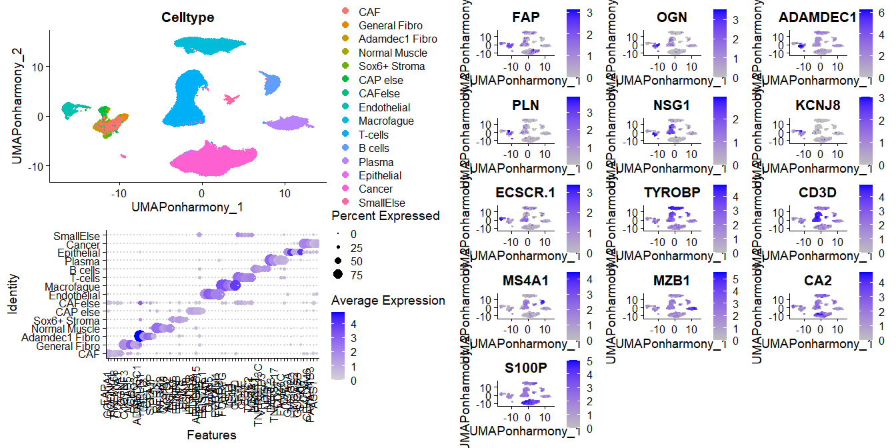

# Umethod

**Umethod** is an R package designed for identifying unique markers in
single-cell data sets, Use the FindUniqueMarkers function on a Seurat
object after clustering to get the most unique markers for your
clusters. CreateImageData can be used with u markers (or any else) for
each cluster for downstream analysis, visualizing the markers on Visium
HD spatial data.

## 🚀 Installation

To install Umethod from GitHub:

#### Install devtools if you haven’t already

install.packages(“devtools”)

#### Install Umethod from GitHub

devtools::install\_github(“YanuvS/Umethod”)

#### Load the package

library(Umethod)

## FindUniqueMarkers algorithm

<figure>

<figcaption aria-hidden="true">process: Scoring each gene for each
cluster, then testing for significant markers</figcaption>
</figure>

### 📈 Example Usage

**Reference:** \[Lee, Hae-Ock, et al. Nature genetics (2020)\].
*“Lineage-dependent gene expression programs influence the immune
landscape of colorectal cancer.”*.

    # Load Umethod
    library(Umethod)
    library("scCustomize")
    library(cowplot)
    library(ggplot2)

    # Load the published data set (replace with the actual data loading code)
    seurat_Full <- readRDS("C:\\Migration\\R projects\\Umethod\\ColonSinglecellDataLeesUmethod.rds")

    # Apply Umethod functions, if there are small/mixed clusters, their name should be added to smallcluster variable to omit them.
    # If the clusters are characters and not numbers, add matchnames = F
    genes_list <- FindUniqueMarkers(obj = seurat_Full,group_by = "Celltype",p.threshold = 0.2,
                                    varfeatures = row.names(seurat_Full),method = "none",
                                    smallcluster = c("CAFelse","SmallElse"),matchnames = F)

    # gene_list is the marker list ordered by score and cluster
    head(genes_list)

    ##        Gene Cluster    Uscore       Dev adj.p.value      P_in      P_out
    ## CD3D   CD3D T.cells 0.6349011 0.7446679           0 0.8525962 0.10792829
    ## CD7     CD7 T.cells 0.4849726 0.6584087           0 0.7365828 0.07817409
    ## CD3E   CD3E T.cells 0.4831791 0.6721255           0 0.7188822 0.04675661
    ## CD2     CD2 T.cells 0.4235852 0.6297494           0 0.6726250 0.04287562
    ## TRBC2 TRBC2 T.cells 0.3110121 0.4530474           0 0.6864891 0.23344164
    ## TRAC   TRAC T.cells 0.3107209 0.3951106           0 0.7864150 0.39130435

    # Choose thresholds 
    u.threshold <- 0.1
    MinDEVthresh <- 0.2
    P_out <- 0.3

    # Pulling the top 5 markers and the name of the top U marker for each cluster
    genesetshort <- unlist(sapply(split(
      genes_list[genes_list$adj.p.value < u.threshold & genes_list$Dev > MinDEVthresh & genes_list$P_out < P_out,],genes_list[genes_list$adj.p.value < u.threshold & genes_list$Dev > MinDEVthresh& genes_list$P_out < P_out,]$Cluster),
      function(x){x[[1]][1]}))

    genesetlong <- unique(unlist(sapply(split(
      genes_list[genes_list$adj.p.value < u.threshold & genes_list$Dev > MinDEVthresh& genes_list$P_out < P_out,],genes_list[genes_list$adj.p.value < u.threshold & genes_list$Dev > MinDEVthresh& genes_list$P_out < P_out,]$Cluster),
      function(x){x[[1]][1:5]})))

    genesetlong

    ##      Adamdec1.Fibro B.cells     CAF       Cancer     CAP.else   Endothelial Epithelial General.Fibro Macrofague
    ## [1,] "ADAMDEC1"     "MS4A1"     "FAP"     "S100P"    "KCNJ8"    "ECSCR.1"   "CA2"      "OGN"         "TYROBP"  
    ## [2,] "HAPLN1"       "BANK1"     "COL11A1" "LCN2"     "HIGD1B"   "PLVAP"     "GUCA2A"   "C1QTNF3"     "FCER1G"  
    ## [3,] "CCL13"        "TNFRSF13C" "PODNL1"  "CEACAM6"  "EDNRA"    "CLDN5"     "VSIG2"    "MFAP5"       "AIF1"    
    ## [4,] "CCL8"         "VPREB3"    "TMEM158" "PAFAH1B3" "ARHGAP15" "VWF"       "HMGCS2"   "CILP"        "LST1"    
    ## [5,] "SFTA1P"       "LY9"       "COL10A1" "ASS1"     "ENPEP"    "PECAM1"    "GUCA2B"   "RSPO3"       "IL1B"    
    ##      Normal.Muscle Plasma     Sox6..Stroma T.cells
    ## [1,] "PLN"         "MZB1"     "NSG1"       "CD3D" 
    ## [2,] "RERGL"       "DERL3"    "ENHO"       "CD7"  
    ## [3,] "NTRK2"       "TNFRSF17" "EDNRB"      "CD3E" 
    ## [4,] "C2orf40"     "CD27"     "BMP5"       "CD2"  
    ## [5,] "ACTG2"       "FAM46C"   "SOX6"       "TRBC2"

    #Order the cluster that had at least one marker that passed threshold, as you want them to be plotted.
    clusterorder<- c("CAF","General.Fibro","Adamdec1.Fibro","Normal.Muscle","Sox6..Stroma","CAP.else","Endothelial","Macrofague","T.cells","B.cells","Plasma","Epithelial","Cancer")
    # Ordering the clusters that had any umarkers from genesetlong for dotplot
    indclusters <- rep(NA,dim(genesetlong)[2])
    for(i in 1:dim(genesetlong)[2]){indclusters[i] <- which(colnames(genesetlong) == clusterorder[i])}

    genesetlong <- genesetlong[,indclusters]
    genesetshort <- genesetshort[indclusters]

# Plotting the results of the top U markers for each cluster

