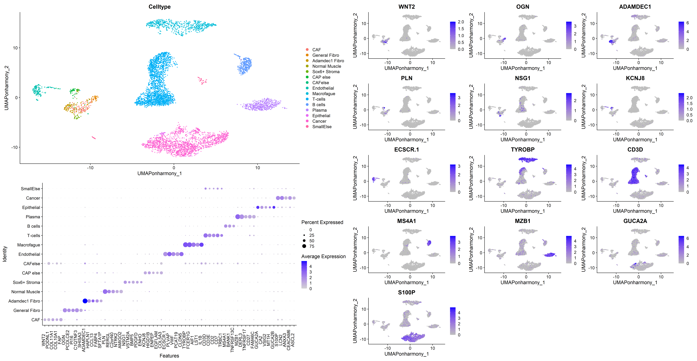

# Umethod

**Umethod** is an R package designed for identifying unique markers in
single-cell data sets, Use the FindUniqueMarkers function on a Seurat
object after clustering to get the most unique markers for your
clusters. CreateImageData function can be used with U markers (or any
other markers) for each cluster for downstream analysis, visualizing the
markers on Visium HD spatial data.

## 🚀 Installation

To install Umethod from GitHub:

#### Install remotes if you haven’t already

install.packages(“remotes”)

#### Install Umethod from GitHub

remotes::install\_github(“YanuvS-Dev/Umethod”)

#### Load the package

library(Umethod)

## FindUniqueMarkers algorithm

### 📈 Example Usage

**Reference:** \[Lee, Hae-Ock, et al. Nature genetics (2020)\].
*“Lineage-dependent gene expression programs influence the immune
landscape of colorectal cancer.”*, available from ArrayExpress
E-MTAB-8410.

To load the reananlyzed example data set directly from GitHub, use the
following code in R

    # Load Umethod
    library(Umethod)
    library("scCustomize")
    library(cowplot)
    library(ggplot2)
    library(svMisc)

    # Load the published data set (replace with the actual data loading code)
    rds_url <- "https://github.com/YanuvS-Dev/Umethod/raw/master/inst/extdata/ColonSinglecellDataLeesUmethodSubsampled10.rds"
    seurat_Full <- readRDS(url(rds_url, "rb"))

    # Apply Umethod functions, if there are small/mixed clusters, their name should be added to smallcluster variable to omit them.
    # The progress bar prints weird massages, in this rmd file I suppress it
    genes_list <- FindUniqueMarkers(
        obj = seurat_Full,
        group_by = "Celltype",
        method = "none",
        smallcluster = c("CAFelse", "SmallElse"),
        progresstext = F)

    # gene_list is the marker list ordered by score and cluster
    head(genes_list)

    ##            Gene Cluster    Uscore  adj.p.value      P_in     P_out
    ## S100P     S100P  Cancer 0.5463567 2.184539e-06 0.8105077 0.2641509
    ## LCN2       LCN2  Cancer 0.5145713 7.177230e-06 0.7880756 0.2735043
    ## ANXA3     ANXA3  Cancer 0.4887284 1.803291e-05 0.6511216 0.1623932
    ## CEACAM6 CEACAM6  Cancer 0.4617251 4.520007e-05 0.7266824 0.2649573
    ## ASCL2     ASCL2  Cancer 0.4550298 5.637563e-05 0.5832349 0.1282051
    ## MAL2       MAL2  Cancer 0.4509430 6.442831e-05 0.8099174 0.3589744

    # Choose thresholds 
    Uscore <- 0.25
    p_in <- 0.4
    p_out <- 0.3

    # Pulling the top 5 markers and the name of the top U marker for each cluster

    genesetshort <- unlist(sapply(split(genes_list[genes_list$Uscore > Uscore & genes_list$P_in > p_in & genes_list$P_out < p_out,],genes_list[genes_list$Uscore > Uscore & genes_list$P_in > p_in& genes_list$P_out < p_out,]$Cluster),function(x){x[[1]][1]}))

    genesetlong <- unique(unlist(sapply(split(genes_list[genes_list$Uscore > Uscore & genes_list$P_in > p_in& genes_list$P_out < p_out,],genes_list[genes_list$Uscore > Uscore & genes_list$P_in > p_in& genes_list$P_out < p_out,]$Cluster),function(x){x[[1]][1:5]})))

    genesetlong

    ##      Adamdec1.Fibro B.cells     CAF       Cancer    CAP.else Endothelial Epithelial General.Fibro Macrofague Normal.Muscle
    ## [1,] "ADAMDEC1"     "MS4A1"     "WNT2"    "S100P"   "KCNJ8"  "ECSCR.1"   "GUCA2A"   "OGN"         "TYROBP"   "PLN"        
    ## [2,] "HAPLN1"       "BANK1"     "PODNL1"  "LCN2"    "HIGD1B" "PLVAP"     "CA2"      "PCOLCE2"     "FCER1G"   "RERGL"      
    ## [3,] "CCL13"        "TNFRSF13C" "COL11A1" "ANXA3"   "ENPEP"  "VWF"       "VSIG2"    "PI16"        "AIF1"     "C2orf40"    
    ## [4,] "FABP4"        NA          "COL10A1" "CEACAM6" "EGFLAM" "PCAT19"    "MT1H"     "C1QTNF3"     "LST1"     "NTRK2"      
    ## [5,] "SFTA1P"       NA          "FAP"     "ASCL2"   "COL5A3" "CLDN5"     "GUCA2B"   "SHISA3"      "IL1B"     "AMIGO2"     
    ##      Plasma     Sox6..Stroma T.cells
    ## [1,] "MZB1"     "NSG1"       "CD3D" 
    ## [2,] "DERL3"    "VSTM2A"     "CD3E" 
    ## [3,] "TNFRSF17" "BMP5"       "CD2"  
    ## [4,] "CD27"     "PDGFD"      "CD7"  
    ## [5,] "FAM46C"   "ENHO"       "TRBC1"

    #Order the cluster that had at least one marker that passed threshold, as you want them to be plotted.
    clusterorder<- c("CAF","General.Fibro","Adamdec1.Fibro","Normal.Muscle","Sox6..Stroma","CAP.else","Endothelial","Macrofague","T.cells","B.cells","Plasma","Epithelial","Cancer")
    # Ordering the clusters that had any umarkers from genesetlong for dotplot
    indclusters <- rep(NA,dim(genesetlong)[2])
    for(i in 1:dim(genesetlong)[2]){indclusters[i] <- which(colnames(genesetlong) == clusterorder[i])}

    genesetlong <- genesetlong[,indclusters]
    genesetshort <- genesetshort[indclusters]

# Plotting the results of the top U markers for each cluster

