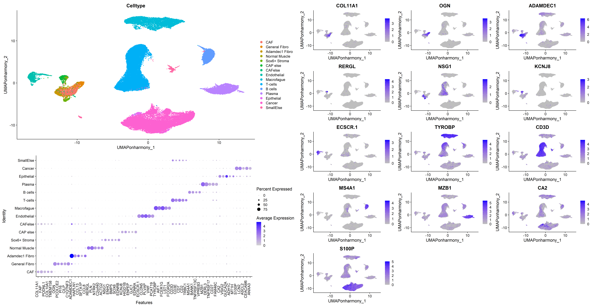

# U-method: Identify Unique Markers in Single-Cell Data

**Umethod** is an R package designed to identify **unique markers** in
single-cell datasets. It provides methods for finding the most distinct
markers for each cluster in a **Seurat object** and visualizing them in
**Visium HD spatial data**.

## Installation

To install **Umethod** from GitHub:

    # Install devtools if you haven't already
    install.packages("devtools")

    # Install Umethod from GitHub
    devtools::install_github("YanuvS-Dev/Umethod")

    # Load the package
    library(Umethod)

## FindUniqueMarkers Algorithm

The `FindUniqueMarkers` function identifies the most **unique markers**
for each cluster in a Seurat object.

## Example Usage

### Reference Dataset

This example uses a **reanalyzed** dataset from:

-   **Lee, Hae-Ock, et al. Nature Genetics (2020)**  
-   *“Lineage-dependent gene expression programs influence the immune
    landscape of colorectal cancer.”*  
-   Available: [ArrayExpress
    E-MTAB-8410](https://www.ebi.ac.uk/arrayexpress/experiments/E-MTAB-8410/)

### Load Example Data

    # Load Umethod
    library(Umethod)
    library(cowplot)
    library(ggplot2)
    library(svMisc)
    library(Seurat)
    library(reshape2)

    # Load the published data set (replace with the actual data loading code)
    rds_url <- "https://github.com/YanuvS-Dev/Umethod/raw/master/inst/extdata/ColonSinglecellDataLeesUmethodSubsampled10.rds"
    seurat_Full <- readRDS(url(rds_url, "rb"))

    # Apply Umethod functions, if there are small/mixed clusters, their name should be added to omitCluster variable to omit them.
    # The progress bar prints weird massages, in this rmd file I suppress it
    genes_list <- FindUniqueMarkers(
        obj = seurat_Full,
        group_by = "Celltype",
        method = "BH",
        omitCluster = c("CAFelse", "SmallElse"))

    # gene_list is the marker list ordered by score and cluster
    head(genes_list)

    ##               Gene        Cluster    Uscore  adj.p.value      P_in     P_out
    ## ADAMDEC12 ADAMDEC1 Adamdec1 Fibro 0.7433797 3.652416e-05 0.9595960 0.2162162
    ## HAPLN12     HAPLN1 Adamdec1 Fibro 0.5653907 2.152610e-02 0.6969697 0.1315789
    ## CCL132       CCL13 Adamdec1 Fibro 0.4812454 2.339913e-01 0.5757576 0.0945122
    ## FABP42       FABP4 Adamdec1 Fibro 0.4189723 5.841738e-01 0.6363636 0.2173913
    ## APOE2         APOE Adamdec1 Fibro 0.3962264 5.841738e-01 1.0000000 0.6037736
    ## SFTA1P2     SFTA1P Adamdec1 Fibro 0.3916084 5.841738e-01 0.5454545 0.1538462

    # Choose thresholds 
    Uscore <- 0.25
    p_in <- 0.4

### Selecting Top Markers

    genesetshort <- unlist(sapply(
        split(genes_list[genes_list$Uscore > Uscore & genes_list$P_in > p_in, ], 
              genes_list[genes_list$Uscore > Uscore & genes_list$P_in > p_in, ]$Cluster), 
        function(x) { x[[1]][1] }
    ))

    genesetlong <- unique(unlist(sapply(
        split(genes_list[genes_list$Uscore > Uscore & genes_list$P_in > p_in, ], 
              genes_list[genes_list$Uscore > Uscore & genes_list$P_in > p_in, ]$Cluster), 
        function(x) { x[[1]][1:5] }
    )))

    genesetlong

    ##      Adamdec1 Fibro B cells     CAF       Cancer    CAP else   Endothelial
    ## [1,] "ADAMDEC1"     "MS4A1"     "INHBA"   "S100P"   "KCNJ8"    "ECSCR.1"  
    ## [2,] "HAPLN1"       "BANK1"     "CTHRC1"  "LCN2"    "HIGD1B"   "PLVAP"    
    ## [3,] "CCL13"        "TNFRSF13C" "WNT2"    "ANXA3"   "ENPEP"    "VWF"      
    ## [4,] "FABP4"        "CD37"      "PODNL1"  "CEACAM6" "NDUFA4L2" "PCAT19"   
    ## [5,] "APOE"         NA          "COL11A1" "ASCL2"   "PLXDC1"   "CLDN5"    
    ##      Epithelial General Fibro Macrofague Normal Muscle Plasma     Sox6+ Stroma
    ## [1,] "MT1G"     "OGN"         "TYROBP"   "PLN"         "MZB1"     "NSG1"      
    ## [2,] "GUCA2A"   "PCOLCE2"     "FCER1G"   "RERGL"       "DERL3"    "VSTM2A"    
    ## [3,] "CA2"      "PI16"        "AIF1"     "C2orf40"     "TNFRSF17" "BMP5"      
    ## [4,] "VSIG2"    "C1QTNF3"     "LST1"     "NTRK2"       "CD27"     "F3"        
    ## [5,] "MT1H"     "SHISA3"      "IL1B"     "MYH11"       "FAM46C"   "PDGFD"     
    ##      T-cells
    ## [1,] "CD3D" 
    ## [2,] "CD3E" 
    ## [3,] "CD2"  
    ## [4,] "CD7"  
    ## [5,] "TRBC1"

### Plotting Unique Markers

    clusterorder<- c("CAF","General Fibro","Adamdec1 Fibro","Normal Muscle","Sox6+ Stroma","CAP else","Endothelial","Macrofague","T-cells","B cells","Plasma","Epithelial","Cancer")
    # Ordering the clusters that had any umarkers from genesetlong for dotplot
    indclusters <- rep(NA,dim(genesetlong)[2])
    for(i in 1:dim(genesetlong)[2]){indclusters[i] <- which(colnames(genesetlong) == clusterorder[i])}

    genesetlong <- genesetlong[,indclusters]
    genesetshort <- genesetshort[indclusters]

# Plotting the results of the top U markers for each cluster

## Visualizing Markers on Visium HD

### Load Visium HD Data

To begin, only two essential files are required for analysis. Example
Visium HD data can be accessed from:

Oliveira, Michelli F., et al. (2024). Characterization of immune cell
populations in the tumor microenvironment of colorectal cancer using
high-definition spatial profiling. bioRxiv. \[DOI: 2024-06\]

In this example, we focus on one Normal sample and one Tumor sample.
However, we strongly encourage users to apply the U-Method to all five
available samples to gain deeper insights into spatial marker
distribution and expression patterns.

#### Normal adjacent sample - NAT5

    library(arrow)
    colon.data <- Read10X("C:/myGithub/Uemethod_Bigfiles/VisiumHDcolon/NAT5/8um/filtered_feature_bc_matrix/")

    poaraq <- read_parquet("C:/myGithub/Uemethod_Bigfiles/VisiumHDcolon/NAT5/8um/spatial/tissue_positions.parquet")

    markers <- c(genesetlong)[!is.na(genesetlong)]
    markers <- ifelse(markers == "ECSCR.1","ECSCR",markers)
    markers <- markers[markers %in% row.names(colon.data)]

    seurat_object <- CreateImageData(bc_matrix = colon.data,poaraq = poaraq,markers = markers)

### Calculate Signature Scores

    # Plotting the signature expression of the top 5 markers or less if there arent 5 
    SignaturebyCell <- as.data.frame(matrix(NA,ncol = dim(genesetlong)[2],nrow = nrow(seurat_object@meta.data)))
    for(i in 1:dim(genesetlong)[2])
    {
      x <- genesetlong[,i]
      mdf <- seurat_object@meta.data[,colnames(seurat_object@meta.data) %in% x]
      if(is.null(dim(mdf)))
      {
        SignaturebyCell[,i] <- mdf
        print(paste("Only used",colnames(seurat_object@meta.data)[colnames(seurat_object@meta.data) %in% x],"For",colnames(genesetlong)[i],sep = " "))
      }else{
        SignaturebyCell[,i] <- apply(mdf,1,mean,na.rm = T) 
      }
      print(paste("Finished average expression calculation of",colnames(genesetlong)[i]))
    }

    ## [1] "Finished average expression calculation of CAF"
    ## [1] "Finished average expression calculation of General Fibro"
    ## [1] "Finished average expression calculation of Adamdec1 Fibro"
    ## [1] "Finished average expression calculation of Normal Muscle"
    ## [1] "Finished average expression calculation of Sox6+ Stroma"
    ## [1] "Finished average expression calculation of CAP else"
    ## [1] "Finished average expression calculation of Endothelial"
    ## [1] "Finished average expression calculation of Macrofague"
    ## [1] "Finished average expression calculation of T-cells"
    ## [1] "Finished average expression calculation of B cells"
    ## [1] "Finished average expression calculation of Plasma"
    ## [1] "Finished average expression calculation of Epithelial"
    ## [1] "Finished average expression calculation of Cancer"

    names(SignaturebyCell) <- colnames(genesetlong)
    colnames(SignaturebyCell) <- paste("Signature",colnames(SignaturebyCell),sep = ".")

    seurat_object <- AddMetaData(seurat_object,cbind(seurat_object@meta.data,SignaturebyCell))

### Plot Spatial Expression

Using ggplot to plot the results of the top 5 u-marker average
expression

## Prepare Data

    beforemelt <- seurat_object@meta.data[,colnames(seurat_object@meta.data) %in% c("pxl_row_in_fullres","pxl_col_in_fullres",colnames(SignaturebyCell))]
    aftermelt <- melt(beforemelt, id.vars = c("pxl_row_in_fullres", "pxl_col_in_fullres"))
    names(aftermelt)[3] <- "Class"
    aftermelt$value <- ifelse(aftermelt$value == 0, NA, aftermelt$value)

## Generate Plots

    g <- list()
    color_palette <- c("brown1", "turquoise1", "chartreuse", "magenta", "lightblue", "darkviolet", "#619CFF", "#7F7F7F", "darkolivegreen1", "orange", "ghostwhite", "#C4B239", "darkorange1")

    for (i in colnames(SignaturebyCell)) {
      index <- which(colnames(SignaturebyCell) == i)
      g[[index]] <- ggplot(aftermelt[aftermelt$Class == i & !is.na(aftermelt$value), ], 
                            aes(x = pxl_col_in_fullres, y = pxl_row_in_fullres, color = Class, alpha = value/max(value))) +
        geom_point(size = 0.01) +
        theme_void() +
        scale_y_reverse() +
        guides(colour = guide_legend(override.aes = list(size = 10))) +
        labs(title = paste("Signature:", i)) +
        scale_color_manual(values = color_palette[index]) +
        theme(
          plot.background = element_rect(fill = "black"),
          legend.position = "right",
          legend.justification = "center",
          legend.box.margin = margin(0, 10, 0, 10),
          plot.margin = margin(10, 20, 10, 10),
          legend.text = element_text(color = "white", face = "bold", family = "sans", size = 20, angle = 90)
        ) +
        scale_alpha(guide = 'none')
    }

## Display Plots - Patient 5 normal sample

## Display Plots - Patient 5 tumor sample

## Notes on Signature Expression figure

-   **Normal Samples:** CAF and CAPelse signatures are not expressed.
-   **Tumor Samples:** Cancer signature expression differs from
    Epithelial signature expression only in Tumor samples.

🚀 Now you’re ready to detect unique single-cell markers using the
U-method!
